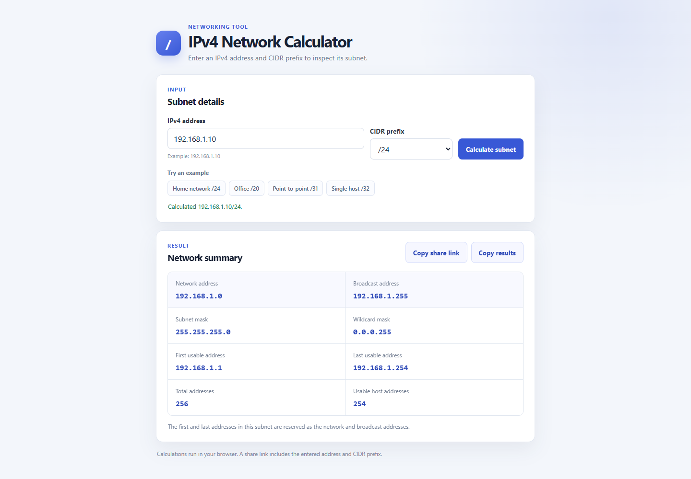

# IPv4 Network Calculator

A browser-based subnet calculator. Enter an IPv4 address and CIDR prefix to see the network range, subnet masks, and address capacity.

**Live demo:** [Open the calculator](https://dav1dushka.github.io/Network-Calculator/)

## Features

- Validate IPv4 octets and calculate prefixes from `/0` through `/32`.
- Display subnet endpoints, subnet and wildcard masks, and the usable address range.
- Handle `/31` point-to-point networks and `/32` host routes explicitly.
- Try common subnet examples without typing an address and prefix.
- Copy the calculated values or a shareable link that restores the same calculation.
- Use the responsive layout on desktop and mobile screens.

## Run locally

1. Clone this repository or download the project files.
2. Open `index.html` in a modern browser.

No package installation, build step, or server-side code is required.

## Calculation notes

For prefixes from `/0` to `/30`, the network and broadcast addresses are excluded from the usable host count. A `/31` has two usable addresses for point-to-point links, and a `/32` represents one host address.

Share links keep the IPv4 address and CIDR prefix in the URL query string. Calculations run in the browser and do not call an external API.

## Project files

- `index.html` contains the input form and results region.
- `style.css` contains the responsive layout.
- `script.js` validates input and calculates subnet details in the browser.

## Built with

HTML · CSS · JavaScript
